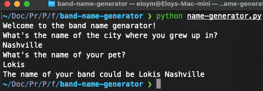

<h2>First project of the 100 days of code with Python.</h2>

This is the first challenge of the 100 days of code: the complete python bootcamp on Udemy.
in this simple piece of code I will create a name of a band combining the name of a pet and the name of a city.

Here's an example:

